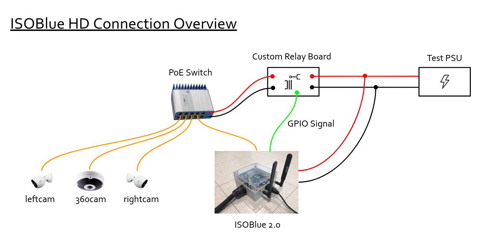

**Embrace yourself, ISOBlue HD is coming.**

<!--truncate-->

For one of the [projects][1] in [OATS][2], we need to improve a multi-cameras
logging system that would record the video streams of a combine's header actions
during harvest operations. The current method involves a human to kick off the
video logging process.

One of the primary goals of using ISOBlue as a sensor platform is to eliminate
the need of human interventions in sensing and collecting different types of
agricultural machinery data. Therefore, this question comes in naturally:

"Can we use an ISOBlue to log videos?"

The answer is **yes**.

Apart from the existing hardware that enable an ISOBlue to collect ISOBUS
data from tractors and combines, we added a few things:

* Internet Protocol (IP) cameras from [Ubiquiti][3] and [GeoVision][4] that
offer RTSP streams
* A Power-Over-Ethernet (PoE) switch from [Veracity][5]
* A custom-made PCB that relays 12VDC with the toggles of an external signal
* A 4TB USB hard drive

The following figure gives an overview of the hardware connections:

For testing purpose, a PSU was included to emulate the power (12VDC) coming from
a typical machine. The 12VDC was splited into two: one for supplying the ISOBlue
and the other for supplying custom relay board we made.

The relay board controlled the power to the PoE switch. Shortly after the
ISOBlue booted, it toggled the GPIO signal to high. The high signal triggered a
FET on the relay board to be turned on. It further activated the relay to allow
the power from the PSU to flow through the board. The output from the relay
board turned the PoE switch on. Finally, the PoE switch supplied power to all of
the IP cameras.

After everything was powered up, ISOBlue automatically assigned IP addresses to
itself as well as the IP cameras by using `dnsmasq` as a DHCP server. For video
logging, `systemd` services that utilized `ffmpeg` commands obtained the RTSP
streams from each camera and saved them onto an external hard drive.

A litte bit of fun: with ISOBlue's LTE connectivity, we port-forwarded three
cameras' RTSP ports to local ports on a desktop in our lab. ISOBlue was
essentially broadcasting the streams to our desktop. By using a common video
player like `VLC player`, we were able to watch live streams of the three
cameras simultaneoulsy as shown in the picture below:

Now we could watch live streams from the cameras when the system is deployed in
the field to check out what the machine is doing (as long as there is LTE
connectivity)!

We also tested the scenario of the ISOBlue going to suspend and waking up. For
suspends, The GPIO pin was pulled down accordingly. As a result, the relay board
was not outputting any more power; the PoE switch was off, and the cameras were
also off. After the ISOBlue woke up, GPIO pulled to high, relay activated, PoE
switch on, cameras on, and ISOBlue restarted video logging sessions.

The first round of tests seemed to be good for ISOBlue HD. We still need to work
on the mounts for cameras as well as a new enclosure for putting everything
together. So stay tuned for updates and pictures!

[1]: https://engineering.purdue.edu/VADL/publications/He_mipr_19.pdf
[2]: https://oatscenter.org/
[3]: https://store.ui.com/products/unifi-video-camera-g3
[4]: https://www.amazon.com/Geovision-GV-FER12203-Fisheye-Rugged-Camera/dp/B019YIXWI0
[5]: http://www.veracityglobal.com/products/networked-video-integration-devices/camswitch-mobile.aspx
