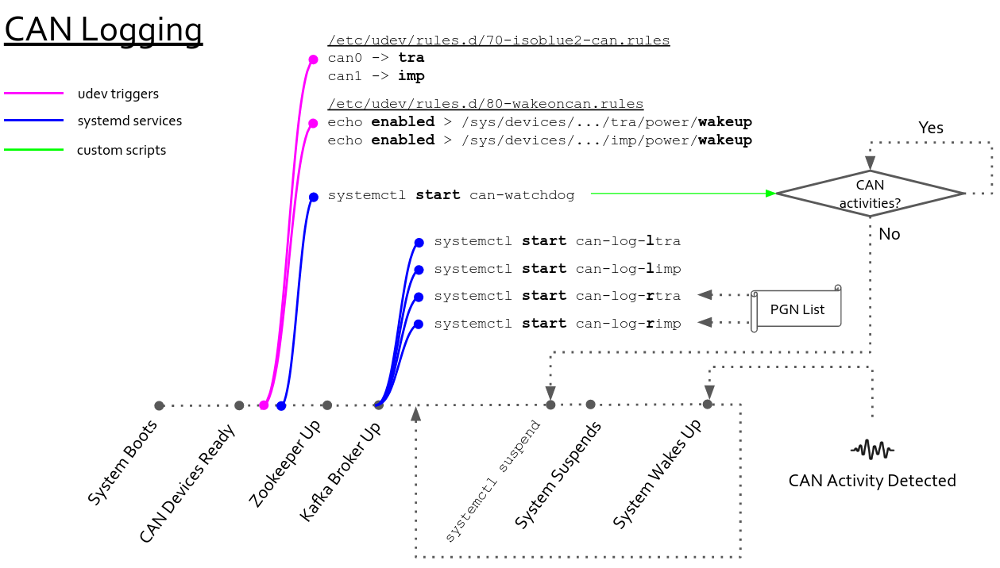

The CAN data logging on ISOBlue 2.0s' is fully automatic. Machine operators need
to install ISOBlues once and these little boxes will take care of the logging of
CAN streams coming from the tractor and the implement busses. No human
intervention needed.

How does everything work under the hood?

<!--truncate-->

In this part of the series, we will look into how ISOBlue 2.0 works in terms
of CAN data logging.

As ISOBlues run on a customized version of Linux. Let us go over two basic
concepts in Linux first:

## udev

`udev` is the device manager for the Linux kernel. It handles all user space
events when hardware devices are added and removed. It primarily manages device
nodes in the `/dev` directory in Linux. For instance, if you plug in a wireless
mouse to your computer, as long as your Linux distribution has the proper driver
for it, `udev` will correspondently match the mouse's `device ID`, load the
driver for you, and voila, you will be move your cursor and navigate your way
within your desktop environment.

Moreover, you can also write custom `udev` rules for running custom scripts
whenever a known device is installed onto a system.

You can read more about it in [here][1].

## systemd

`systemd` is a software suite that handles system/user service configurations
and manages processes in a Linux operation system. You can start, stop, and
restart background services. In addition, you can monitor the statuses of your
background services using `systemd`.

You can read more about it in [here][2].

> The CAN data logging part of ISOBlue relies on these two tools heavily. Once
> you get an idea of what they are for, then the whole workflow which I am about
> to explain is just a piece-of-cake to understand.

## CAN Logging Workflow

You can see from the picture below that the workflow is represented with nodes
within a timeline. Each node on the timeline represents an important event in
our workflow. Now, imagine you are carrying an ISOBlue and want to deploy it in
one of your tractors. You plugged in one end of the ISOBUS diagnostic cable into
the diagnostic port and the other end to your ISOBlue. Here are what will
happen.



### System Boots

This indicates the startup sequence of the ISOBlue. The kernel is working hard
at this point to have all the required system services up and running as well as
registering all the devices along with their drivers.

### CAN Devices Ready

At this point, the two CAN interfaces available on the ISOBlue are enumerated as
`can0` and `can1` in `/dev`.

### Pink Node

As soon as `udev` sees the CAN interfaces are available, it triggers the `udev`
rule [`70-isoblue2-can.rules`][3]:
```
# CAN interface on tractor bus
KERNEL=="can[0-9]*", KERNELS=="2090000.can", NAME="tra", TAG+="systemd", ENV{SYSTEMD_WANTS}="can_up@tra.service"

# CAN interface on implement bus
KERNEL=="can[0-9]*", KERNELS=="2094000.can", NAME="imp", TAG+="systemd", ENV{SYSTEMD_WANTS}="can_up@imp.service"
```
This `udev` rule will rename `can0` and `can1` to `tra` (tractor bus) and `imp`
(implement bus). It will also trigger two `systemd` [services][4] to properly
set up the two interfaces with the correct baudrates.

Moreover, it also triggers another `udev` rule [`80-wakeoncan.rules`][5]. This
rule enables the wake-on-CAN features on two CAN interfaces. Now, the two CAN
interfaces of the ISOBlue are propertly configured.

### First Blue Node

Shortly after the interfaces are set, the [`can-watchdog`][6] service will
start. The service runs a [program][7] that monitors the CAN activities on the
two CAN interfaces. Whenever there is no CAN activity for 5 seconds, the program
will issue a suspend command to the system.

### Zookeeper Up

This indicates the Zookeeper is up and running in the ISOBlue.

### Kafka Broker Up

A Kafka broker is then brought up by a `systemd` [service][8]. Note the
`Requires` line in the systemd service file. The `Requires` is a systemd unit
dependency directive. It means that, in this context, it requires all the
services after the equal sign to run as long as the Kafka broker is up.

```
[Unit]
Description=Apache Kafka Broker Service
Documentation=http://kafka.apache.org/documentation.html
Requires=zookeeper.service can-log-limp.service can-log-ltra.service can-log-rimp.service can-log-rtra.service can-d-mr-imp.service can-d-mr-tra.service heartbeat.service
Before=shutdown.target sleep.target
After=network.target dev-sda1.device zookeeper.service
ConditionPathExists=/opt/kafka

[Service]
Type=simple
ExecStart=/opt/kafka/bin/kafka-server-start.sh /opt/kafka/config/server.properties
ExecStop=/opt/kafka/bin/kafka-server-stop.sh
Restart=on-failure
RestartSec=10
```
Therefore, the broker service spawns four CAN logging services:
* `can-log-ltra`
* `can-log-limp`
* `can-log-rtra`
* `can-log-rimp`

The letter "**l**" stands for **local** and "**r**" stands for **remote**. For
the local Kafka CAN logging services, they logs every single CAN message and
append all of them to Kafka. On the other hand, the remote services log only the
messages specified by a PGN list file. Both local and remote services run the
same [program][9]; different flags are utilized to have them running in
different modes.

### `systemdctl suspend` and System Suspends

Now say you have driven your tractor for some time and need to take a lunch
break. You turn your key and the tractor is off. Now the `can-watchdog` is not
happy, the program cannot see any CAN activity on the CAN interfaces so it tells
the ISOBlue to go to suspend.

Before going to suspend, all system states will be saved to memory and shortly
after `systemctl suspend` has been issued, the ISOBlue goes to suspend.

### System Wakes Up

Now you are back from your lunch break and need to get back to work. You turn on
the tractor. Since the CAN interfaces are configured to wake on CAN, the system
resumes from the suspend state to normal. The system is then restored to
wherever it was left off earlier and start to collect more data.

That's pretty much it. Hope you enjoy the first part of ISOBlue Explained!

[1]: https://www.freedesktop.org/software/systemd/man/udev.html
[2]: https://www.freedesktop.org/wiki/Software/systemd/
[3]: https://github.com/ISOBlue/isoblue2/blob/v2.7/udev/70-isoblue2-can.rules
[4]: https://github.com/ISOBlue/isoblue2/blob/v2.7/systemd/can_up%40.service
[5]: https://github.com/ISOBlue/isoblue2/blob/v2.7/udev/80-wakeoncan.rules
[6]: https://github.com/ISOBlue/isoblue2/blob/v2.7/systemd/can-watchdog.service
[7]: https://github.com/ISOBlue/isoblue2/blob/v2.7/software/producer/can_watchdog/can_watchdog.c
[8]: https://github.com/ISOBlue/isoblue2/blob/v2.7/systemd/broker.service
[9]: https://github.com/ISOBlue/isoblue2/blob/v2.7/software/producer/kafka_can_log/kafka_can_log.c
