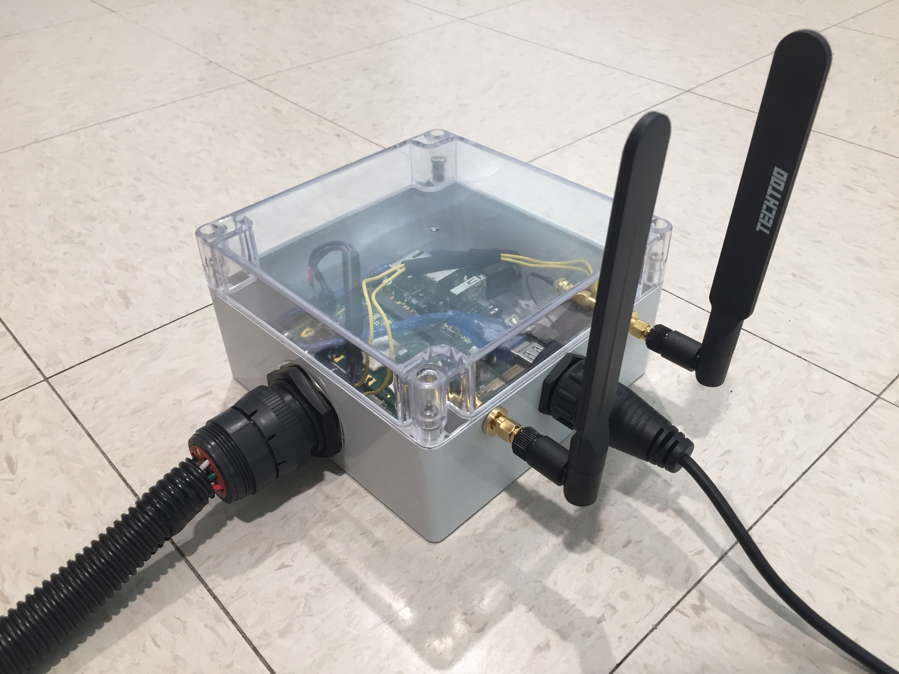

The ISOBlue 2.0 device uses the state-of-art powerful hardware and open-source
software libraries and tools to build an opportunistic ISOBUS data telematic
device for agricultural machinery. It is designed for different machine
operation scenarios. The device’s Wake-on-CAN capability means that one could
leave the device inside a machine and the device will start collecting data
whenever the machine is turned on.  All the data are stored locally in ISOBlue
2.0’s 500GB SSD as it provides an apt storage for a whole season of
as-applied/harvested machine data. The device uses a 4G/LTE connection for
low-latency delievery of collected machine and debug data. Even when the
cellular coverage is intermittent in rural areas, the device software is written
so that it queues up the unsent data and opportunistically stream the data to a
remote Cloud whenenver the network comes back up. The ISOBlue 2.0 device can
also be expanded into an ”ag sensor data hub” as various sensors can be plugged
into the device’s USB ports, microphone jacks, etc. to collect the data of
interest. With the open-source nature of the device’s software, the software
development for experimenting new sensors becomes a collabrative and
easily-adaptable process.
